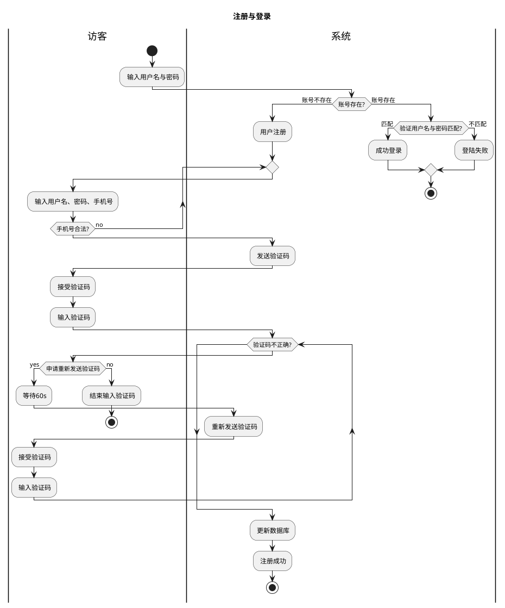
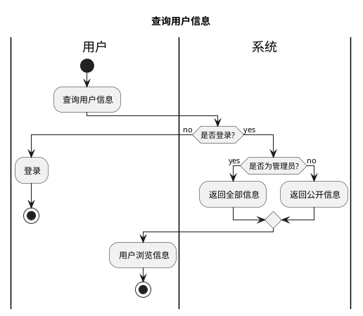
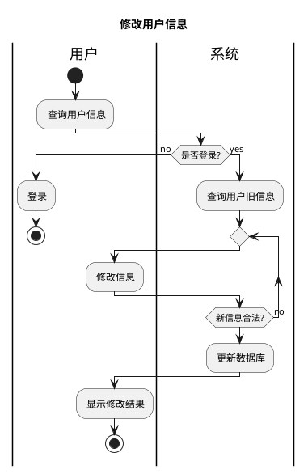

### 活动图
#### 登录
- 访客需要输入用户名和密码进行注册或登录。如果账号不存在，系统将要求访客输入用户名、密码和手机号码，以便注册新账户。如果手机号码不合法，则系统将要求访客重新输入，直到手机号码合法。接下来，系统会向访客发送验证码，让访客输入。如果验证码不正确，访客可以选择重新发送验证码。如果验证码输入正确，系统将更新数据库并告知访客注册成功。如果访客尝试登录，系统将验证输入的用户名和密码是否与数据库中已存在的账号匹配。如果匹配，则访客成功登录，否则访客将收到登录失败的消息。因此，这个活动图的主要功能是指导用户在网站或应用程序中进行注册和登录的过程，并通过检查用户提供的信息和更新数据库来验证用户身份和管理访问。






```puml
title 创建话题组
|用户|
start
: 申请创建;
: 填写主题等;
|系统|
if (审核通过?) then(yes)
: 创建话题组;
: 修改申请人为组长;
else (no)
: 创建失败;
endif
stop
```

```puml
title 修改话题组信息
|用户|
start
: 申请修改;
|系统|
if (群主?) then(yes)
|用户|
: 修改信息;
|系统|
    if (信息审核通过?) then(yes)
    : 更新数据库;
    |用户|
    : 查看修改结果;
    else(no)
    endif
else(no)
endif
|系统|
stop
```

```puml
title 发布话题组内话题
|用户|
start
: 编辑话题内容;
: 申请发送;
|系统|
if (内容审核通过?) then(yes)
: 更新数据库;
|用户|
: 话题组内显示;
else(no)
endif
stop
```

```puml
title 退出话题组
|用户|
start
: 申请退出话题组;
|系统|
if (组长?) then(yes)
: 提示组长转移;
|用户|
: 用户转移组长权限;
else(no)
|系统|
: 更新数据库;
endif
stop
```

```puml
title 转移组长权限
|组长|
start
: 申请转移组长权限;
: 选择组员;
|系统|
: 更新数据库;
stop
```

```puml
title 发布随笔
|用户|
start
: 编辑随笔内容;
: 发送随笔内容;
: 选择公开性(所有人/好友/自己可见);
|系统|
if (内容审核通过?) then(yes)
: 更新数据库;
|用户|
: 浏览随笔;
else(no)
|系统|
: 发送失败;
endif
stop
```

```puml
title 评论别人随笔
|用户|
start
: 编辑评论内容;
: 发送评论内容;
|系统|
if (内容审核通过?) then(yes)
: 更新数据库;
|用户|
: 浏览评论;
else(no)
|系统|
: 发送失败;
endif
stop
```

```puml
title 情绪评价
|用户|
start
: 情绪打卡;
|系统|
if (登录?) then(no)
|用户|
: 用户登录;
else(yes)
|系统|
: 发送情绪评价测试;
|用户|
: 填写测试;
|系统|
: 更新数据库;
: 生成推荐音乐;
|用户|
: 接收音乐;
endif
stop
```

```puml
title 音乐上传
|用户|
start
: 申请上传音乐;
: 选择本地音乐;
: 选择公开性(所有人/好友/自己可见);
|系统|
: 识别音乐文件;
: 分析音乐情绪主题;
if (内容审核通过?) then(yes)
: 更新数据库;
else(no)
: 上传失败;
stop
endif
|用户|
: 收听音乐;
stop
```

```puml
title 查看好友情绪和随笔 和查询用户信息是不是差不多
```

```puml
title 情绪打卡 不知道什么流程

```

```puml
title 退出群
|用户|
start
: 申请退群;
fork
    : 退群;
fork again
    |群主|
    : 收到通知;
|用户|
endfork
stop
```