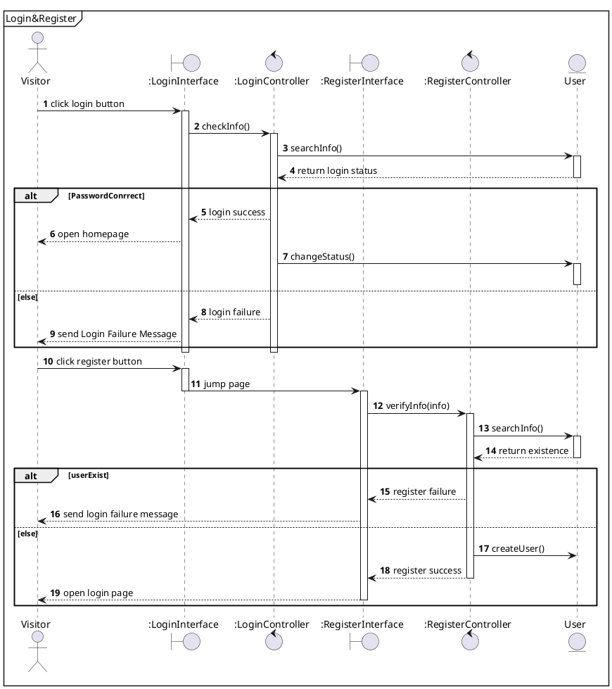
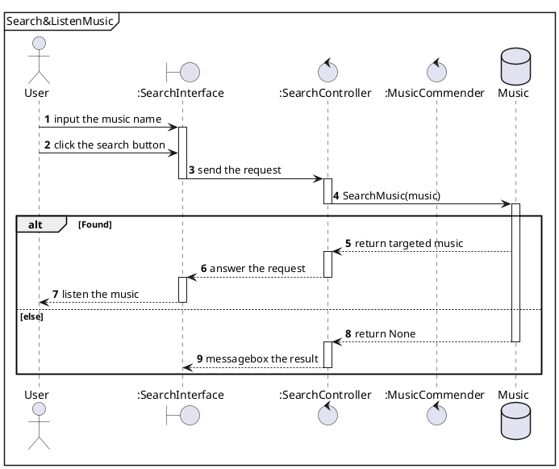
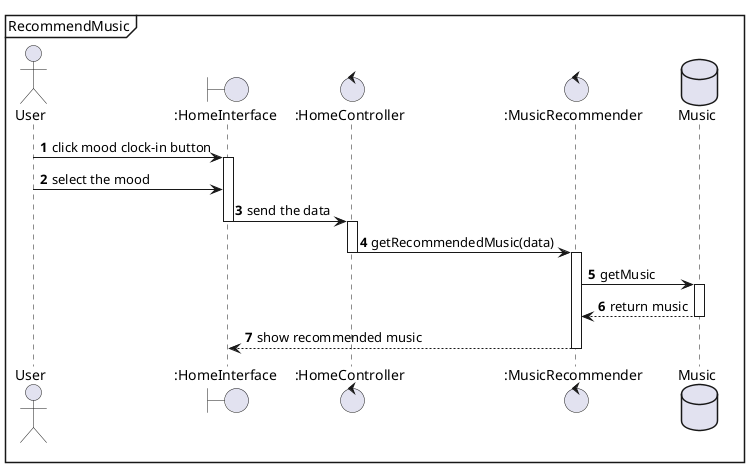
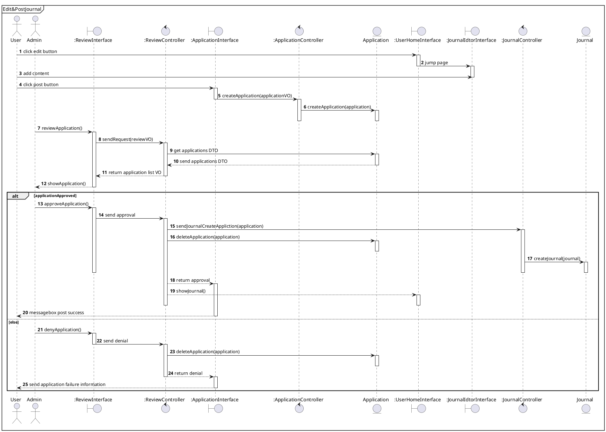
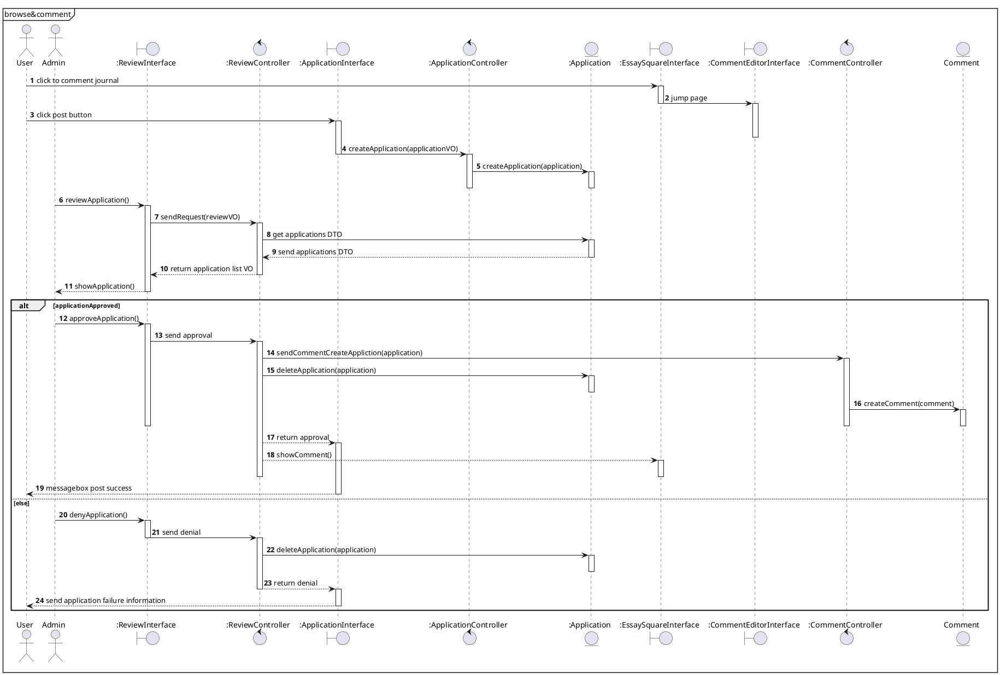
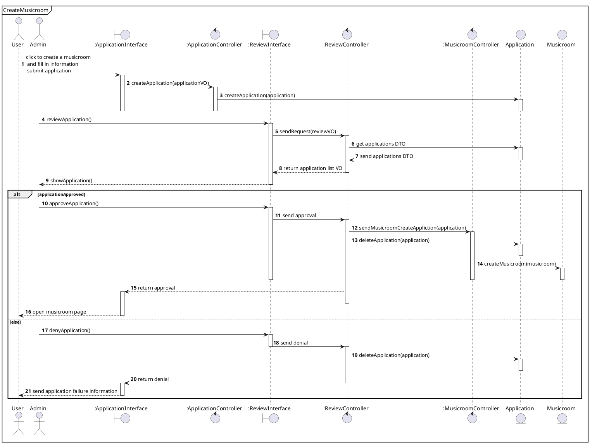
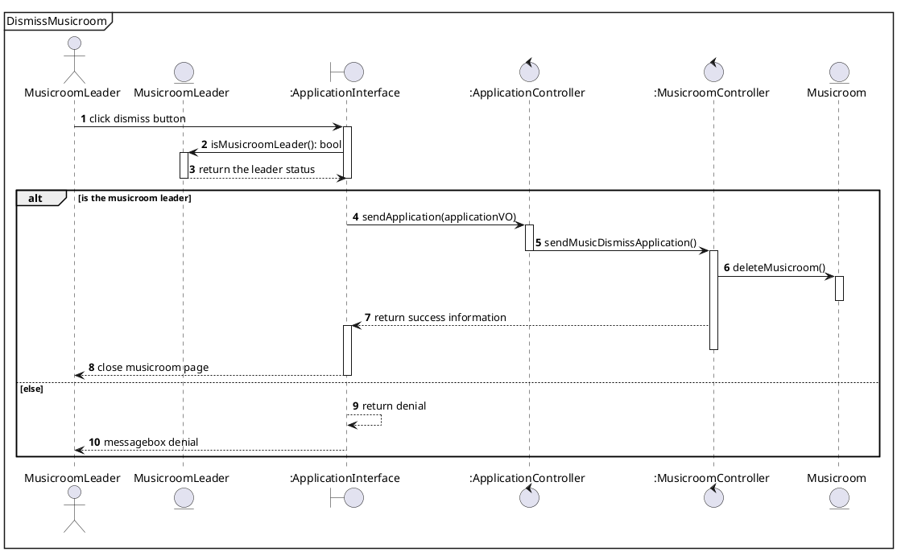
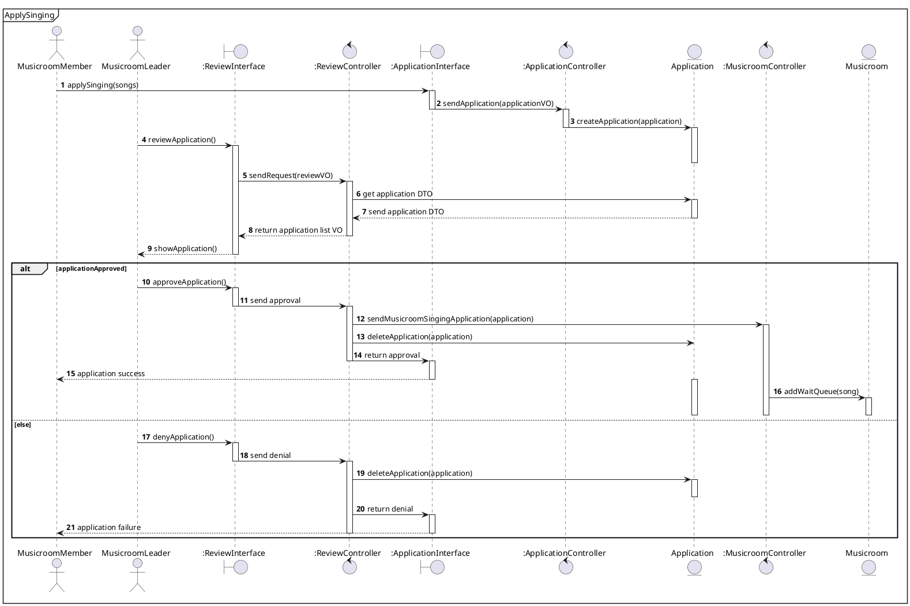

```puml
Class01 <|-- Class02: 继承
Cf <|.. Ci: 实现
Class03 *-- Class04: 组合
Class05 o-- Class06: 聚合
A <-- B: 关联
C <.. D: 依赖
```
## 注册登录
### 类图
```puml
class LoginController{
    + searchInfo()
}
class LoginPage{
    + Login: Button
    + Signup: Button
    + Email: TextBox
    + Password: TextBox
    
    + checkInfo()
    + openRegister()
}
LoginController <.. LoginPage

class RegisterController{
    + createUser()
    + findInfo()
}
class RegisterPage{
    + Register: Button
    + Information: textBox
    + verifyRegister(info)
}
RegisterController <.. RegisterPage
```
### 交互图

## 音乐推荐
```puml
class Visitor{
    + VisitorID: string
    + searchMusic()
}
class User{
    + userID: string
    + userName: string
    + email: string
    - password: string
    - phone: string

    + getRecommendedMusic()
    + sendMood

    + getUserInfo(): content
    + setUserInfo()
    + createMusicroom()
    + joinMusicroom()
}
class Admin{
    + setSystemRecommendedMusic()
}

class MusicHomePage{
    + moodList: list
    + recommendedMusic: list
    + searchBar: TextBox

    + UserID: string
    + UserName: string
    + UserFriendNum: uint
    + UserMoodValue: int
    + UserVisitor: uint
    + UserSongList: list

    + startMusicButton: Button
    + pauseMusicButton: Button
    + nextMusicButton: Button
    
    + localMusicButton: Button
    + userFollowingButton: Button
    + userLikeButton: Button
    + userRecentListenButton: Button

    + startMusic()
    + pauseMusic()
    + nextMusic()

    + getLocalMusic()
    + getUserFollowing()
    + getUserLike()
    + getUserRecentListen()

    + getRecommendedMusic()
}

class MusicHomePageController{
    + searchRecommendedMusic()
    + checkUserDB()
    + checkMusicDB()
}


Visitor <|-- User
User <|-- Admin

Visitor -- MusicHomePage
User -- MusicHomePage
Admin -- MusicHomePage

MusicHomePage ..> MusicHomePageController
```
### 交互图
#### 搜索&听音乐

#### 音乐推荐至个人


## 个人空间
### 类图
```puml
class User{
    + userID: string
    + userName: string
    + email: string
    - password: string
    - phone: string

    + getRecommendedMusic()
    + sendMood

    + getUserInfo(): content
    + setUserInfo()
    + createMusicroom()
    + joinMusicroom()
}
class UserJournalPage{

}
class JournalSearchController{

}
class JournalSendController{

}
class Comment{
    + senderID: string
    + content: string
    + sendTime: time

    + setInfo()
}
class UserHomePage{

}
class UserHomePageController{
    
}
class JournalIdtorPage{

}
class EssaySquarePage{

}
```
### 交互图
#### 编辑并发布随笔

#### 浏览或评论随笔

## 音乐室
### 类图
```puml
class User{
    + userID: string
    + userName: string
    + email: string
    - password: string
    - phone: string

    + getRecommendedMusic()
    + sendMood

    + getUserInfo(): content
    + setUserInfo()
    + createMusicroom()
    + joinMusicroom()
}
class MusicroomMember{
    + applySinging()
    + quitMusicroom()
    + singSong()
}
class MusicroomLeader{
    + disbandMusicroom()
    + manageSingingList()
}


class ReviewPage{
    + musicroomInfo: TextBox
    + musciroomList: list
    + approveButton: Button
    + denyButton: Button

    + sendResult()
    + returnResult()
    + showMusicroom()
    + sendRequest()
}
class ReviewController{
    + checkMusicroomDB()
    + sendMusicroomCreateApplication()
    + deleteMusicroom()
    + getMusicroom()
}
class MusicroomPage{
    + musicroomName: string
    + memberNumber: uint

    + musicroomList: list
    + friendList: list
    + musicMember: list

    + musicSet: set
    + currentLyrics: string
    + currentMusicName: string

    + waitQueue: list

    + applySingingButton: Button
    + addMusicButton: Button
    + sendEmojiButton: Button
    + sendImageButton: Button
    + sendGiftButton: Button

    + applySinging()
    + addMusic()
    + sendEmoji()
    + sendImage()
    + sendGift()
}
class MusicroomPageController{
    + checkMusicroomDB()
    + sendMusicroomCreateApplication()
    + deleteMusicroom(musicroom)
    + setMusicroomLeader(leaderInfo)
}
class Musicroom{
    + musicroomID: string
    + musicroomName: string
    + musicroomLeaderID: string
    + musicroomLeaderName: string
    + musicroomMember: list
    + isDeleted: bool
    + memberNumber: uint

    + getMusicroomInfo()
    + setMusicroomInfo()
    + getMemberList()
}
class MusicroomController{
    + createMusicroom(musicroom)
    + deleteMusicroom(musicroom)
}
User -- ReviewPage
User -- MusicroomPage
MusicroomMember -- MusicroomPage
MusicroomLeader -- ReviewPage
MusicroomLeader -- MusicroomPage

ReviewPage ..> ReviewController
MusicroomPage ..> MusicroomPageController

ReviewController ..> Musicroom

ReviewController ..> MusicroomController
MusicroomPageController ..> MusicroomController

Musicroom <.. MusicroomPageController

User <|-- MusicroomMember
MusicroomMember <|-- MusicroomLeader
```
### 交互图
#### 创建音乐室

#### 解散音乐室

#### 申请唱歌
